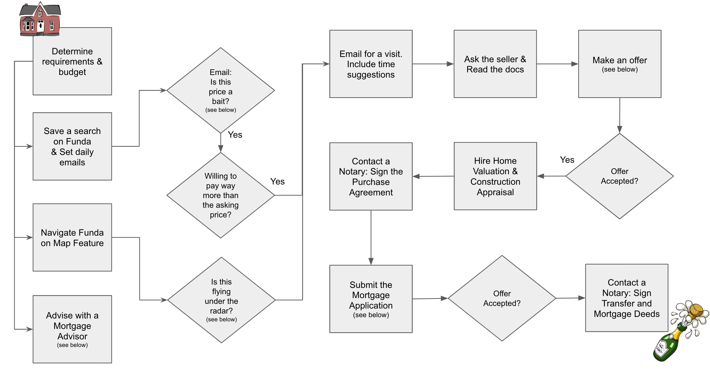

# TLDR; How to buy a house in Amsterdam

 

**DISCLAIMER: THIS IS NOT PROFESSIONAL. I AM NOT A BROKER, NEITHER HAVE PARTICULAR EXPERTISE. IT IS JUST A SHARE OF MY PERSONAL EXPERIENCE. YOUR ACTIONS, YOUR RESPONSIBILITY.**

 

## General Workflow

  

 

## Sample Offer

First of all, thank you for the time to show me the appartment. Hereby, I make a move forward to an offer.
 
I am a `{{ age }}` years old `{{ profession }}`, came to the Netherlands as a highly skilled imigrant working for a company here in Amsterdam. My `{{ familyMembers }}` are coming in the next month and it would be amazing if we could also have a great family story at this house!
 
My total offer: `{{ totalOfferValue }}`kk
 
Subject to:
> Counterpart from own resources must be paid roughly one week before the Transfer Deed.
- Mortgage: expected to pay € `{{ upfrontAmount }}` with own resources + € `{{ mortgageAmount }}` (+fees +taxes) with mortgage sourced
resources. Balance of mortgage and own resources may vary depending on the date of the purchase deed.
> If the Mortgage is not approved during the Reservation time, the contract is dissoluted without a penalty. After is subject to often 10% penalty.
- Financial Reservation up to `{{ weeks }}` weeks after the deed of signature of the purchase agreement at the notary.
- Delivery date: `{{ deliveryDate }}`.
- Technical inspection to be conducted before the notarial deed.

> Feel not many people are interested in the shou? Stipulate an expiration date rather than wait for the Bid date.
> Want to check if the Bid date is real? Ask the broker to give you an extra day.

This offer is valid until February 30th - 12pm.

Additional furniture to be delivered with:
- Benches; Dinning Table; Chairs, Cabinet, etc.

 

## Estimated Value:
> Think of your offer based on the estimated price. Some asking prices are bait to attract visitors, expect for higher offers in this case.
- Funda square meter price
- Saves on Funda
- Days on Funda
- Year of construction
- Woz
- Distance to the City Center

### Patterns for the Bait Price vs "flying under the radar":
- Low vs High -> Price range for 1 bedroom.
- Multiples vs Single -> Bedroom.
- Premium vs Afar -> Location.
- Unique vs Absence -> external area (garden, balcony, rooftop).
- Immaculate vs Potential -> requires renovation.
- Low vs High -> Price compared to similars in the vicinity.
- \> 50 vs < 15 -> Saves on Funda.
> Realistic prices can scare potential buyers, an announced price can be lower than a highly disputed Bid.

 

## Advisors
- Offers packages from finding a match to your requirements, visiting, negotiating and handling all documentation to transfer only handling the technicalities.
- Packages are generally cheaper than the sum of individual services.
- Buyers broker may help to negotiate the deal, but have your own research on the price.

 

## Mortgage
- Max general rule: 5x of gross salary.
- Less than 6 months in the NL: Max up to 85% of the house value.
- A&B Labels discount in interest rate.
- Banks generally have first free session.
- Currently, Variable rate is often half of long term Fixed. If you plan to repay extra, evaluate Variable. 
- Advisors can look for multiple banks and options: a cheaper mortgage deal can save enough for the fee. 

### Mortgage Documents: Issuer / Asking time / Lasting
- Employer's statement: Employer / 2 weeks / 1 month.
- Statement of payment account (PDF): Bank / Immediate / 1 month.
- Salary Slip: Employer / Immediate (check in advance) / 1 month
- Printout of “My pension summary”: [Link](https://mijnpensioenoverzicht.nl) / Immediate.
- Work history printout from UWV: [Link](https://uwv.nl/particulieren/formulieren/digitaal-verzekeringsbericht.aspx) / Immediate.
- Valuation report: Advisor / 2 weeks.
- Copy of the purchase deed signed by all parties.
- ID card Citizen Service Number (BSN).
